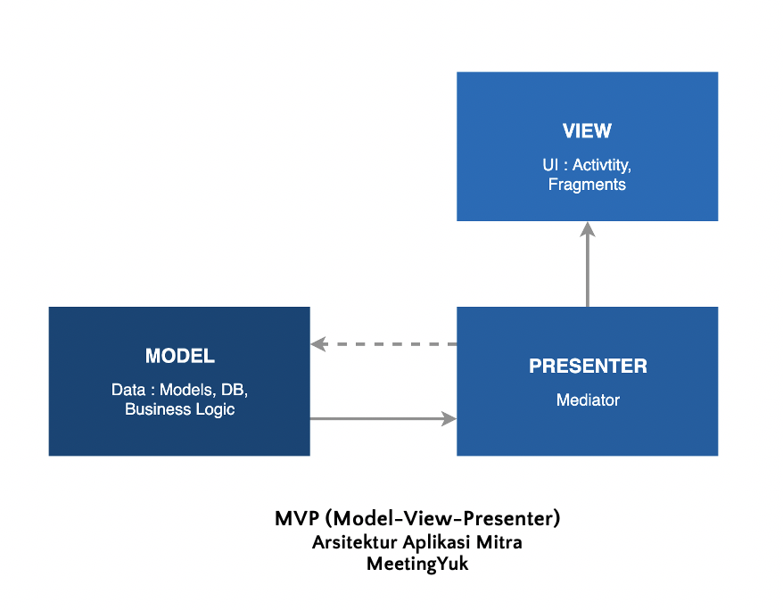

# Aplikasi MeetingYuk Merhcant

Aplikasi MeetingYuk Merchant merupakan salah satu aplikasi MeetingYuk yang dibuat untuk mitra dari MeetingYuk. Tujuan dibuatnya aplikasi ini adalah agar integrasi antara aplikasi MeetingYuk yang telah dikembangkan sebelumnya dengan mitra MeetingYuk dapat terjadi, sehingga pengguna dapat memesan tempat secara langsung dalam membuat acara pertemuan.

### Unduh Aplikasi
Aplikasi MeetingYuk Merchant dapat diunduh dengan mengunjungi link [berikut][apkmeetingyuk].

# Arsitektur Project
Aplikasi ini dibangun menggunakan arsitektur MVP (Model View Presenter).

- Model : Layer yang bertanggung jawab sebagai definisi aturan bagaimana data dapat diubah dan dimanipulasi.
- View : Layer untuk menampilkan data dan memberikan interaksi ke pengguna
- Presenter : Layer untuk menerima masukan dari pengguna melalui View dan memproses masukan dengan menggunakan bantuan data dari Model dan output akan dikembalikan lagi ke pengguna.

## Struktur Project
Struktur dari project ini dibagi berbasis per fitur (tidak langsung membagi berdasarkan  arsitektur)
```
app
│   README.md
│
└───Fitur 1
│   │   Model
│   │   [Fitur 1]Activity
│   │   [Fitur 1]Contract
│   │   [Fitur 1]Presenter
│   |   [Fitur 1]Adapter
|   
└───Fitur 2
│   │   Model
│   │   [Fitur 2]Activity
│   │   [Fitur 2]Contract
│   │   [Fitur 2]Presenter
│  
└───Utils
│  
└───Database
│   └───Converter
|       |   converter 1
│   └───DAO
│       │   [fitur]DAO
│  
└───API
|   |   APIUtils
|   |   InterfaceAPI

```
- [Fitur] Activity : berfungsi sebagai layer View dimana layer menampilkan data dan memberikan interaksi ke pengguna
- [Fitur] Contract : berfungsi sebagai "kontrak" fungsi apa saja yang dapat dilakukan dalam sebuah View dan Presenter. Kontrak ini berfungsi sebagai skeleton nantinya fitur ini dapat melakukan hal apa saja
- [Fitur] Presenter : berfungsi untuk mengolah data dari data yang dimasukkan oleh pengguna melalui View
- Model : berfungsi untuk definisi aturan bagaimana data nantinya dapat diubah dan dimanipulasi. Data ini bisa berupa data dari live data (API) maupun data yang digunakan dalam database.
- Utils : sebagai

[apkmeetingyuk]: https://drive.google.com/file/d/1aJFr735BzbhJ48iiIVwsgw0HJfZSwxRA/view?usp=sharing