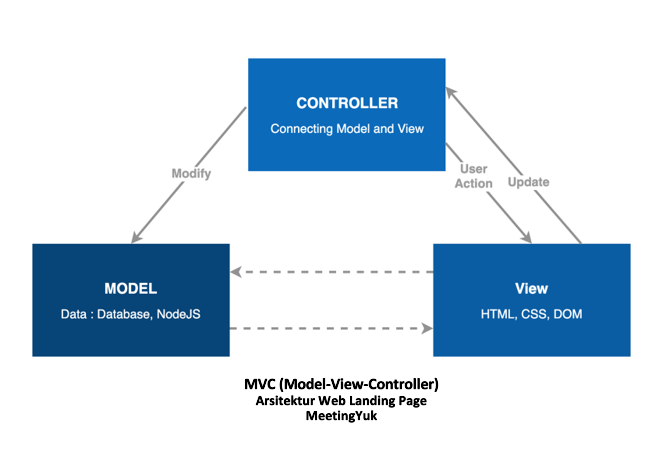

# Web Landing Page MeetingYuk

Web landing page MeetingYuk terdiri dari landing page untuk pengguna dan landing page untuk mitra. Web landing page berfungsi sebagai sarana profiling bagi MeetingYuk dan mitra merchant.

### Menuju Web Landing Page
Web landing page MeetingYuk dapat dikunjungi melalui link [Web landing page pengguna MeetingYuk](https://meetingyuk.com/user) dan [Web landing page mitra MeetingYuk](https://meetingyuk.com/mitra).

### Source Code Web Landing Page
Source code web landing page MeetingYuk dapat didownload dalam file [landing-page-develop.zip]

# Arsitektur Project
Web landing page pengguna dan mitra dibangun menggunakan arsitektur MVC (Model View Controller).

- Model : Model mengatur data-data yang ada di web landing page dan menghubungkan landing page dengan database sehingga dapat mengatur, menyiapkan, memanipulasi dan mengorganisasikan data (dari database) sesuai dengan instruksi dari controller.
- View : Merepresentasikan User Interface, dimana View berinteraksi langsung dengan end user(pengguna). Bertugas untuk menyajikan informasi kepada pengguna sesuai dengan instruksi dari controller.
- Controller : Menghubungkan antara Model dan View, controller menjawab aksi yang dilakukan user terhadap View. Controller berfungsi  mengatur apa yang harus dilakukan model, dan view mana yang harus ditampilkan berdasarkan permintaan dari user.

## Struktur Project
Berikut merupakan struktur dari web landing page MeetingYuk.
```
app
│   README.md
│
└───Fungsi
│   │   Model
│   │   View
│   │   Controller
|   
└───Database
│  
└───API
|   |   APIUtils
|   |   InterfaceAPI
|
└───....
```
- Model : berisi deklarasi aturan bagaimana data dapat diubah dan dimanipulasi. Data-data berupa live data(API) nantinya akan dipanggil oleh controller. Digunakan pula Node.JS untuk server side programmingnya.

- View : digunakan DOM(Document Object Model). DOM digunakan untuk membuat image slider, menampilkan error, dan  mengubah navigation menu. jQuery juga digunakan untuk menyederhanakan  HTML dan CSS. Selain itu digunakan Bootstrap 3.0 agar web yang lebih responsif dan menyederhanakan code.

- Controller : mengontrol jalannya landing page agar dinamis. Mengatur request yang masuk dan memberikan feedback tergantung request pengguna. 

- Database : terdiri dari pengaturan yang berhubungan dengan penggunaan Room Database. Berisi yang data berkaitan dengan mitra MeetingYuk.

- API : berisi setup dan deklarasi API yang akan digunakan. Terdapat 2 File didalamnya yaitu APIUtils dan InterfaceAPI. APIUtils berfungsi sebagai file yang membantu mendeklarasikan kebutuhan API. Sedangkan InterfaceAPI berisi API apa saja yang akan digunakan.


## Daftar API
Berikut merupakan daftar API yang digunakan dari Sistem Backend MeetingYuk untuk membangun aplikasi mitra ini :

| Fitur | Activity | API |
| ------ | ------ | ------------ |
| Pengelolaan Daftar Layanan | Daftar Layanan | https://api.meetingyuk.com/merchant/service |
| | Edit Layanan | https://api.meetingyuk.com/merchant/service/update/:id_service |
| Pengelolaan Profil | Detail Profil Mitra | https://api.meetingyuk.com/user/merchant/get-detail?id=id_merchant |
| | Mengubah Profil Mitra | https://api.meetingyuk.com/merchant/update-profile |
| Profil Mitra | Gambar Tempat Mitra | https://api.meetingyuk.com/merchant/photos |


[apkmeetingyuk]: https://drive.google.com/file/d/1aJFr735BzbhJ48iiIVwsgw0HJfZSwxRA/view?usp=sharing
